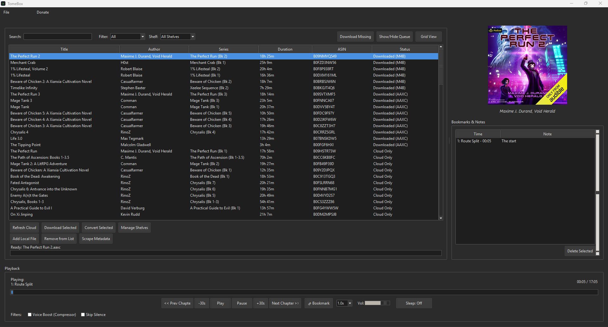
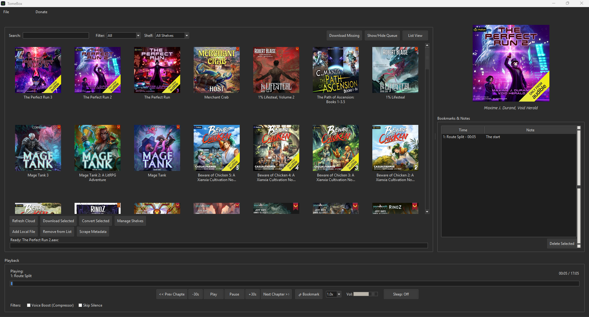
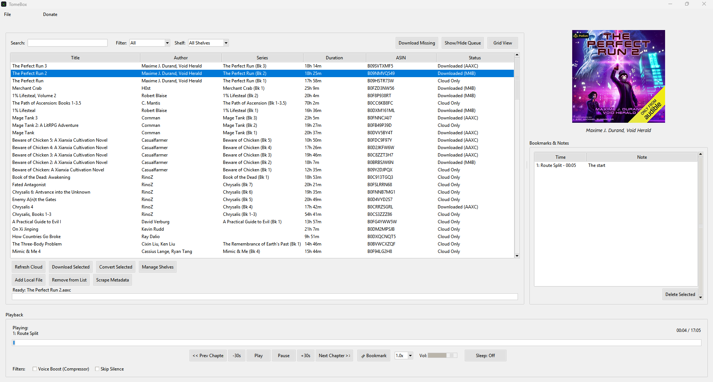
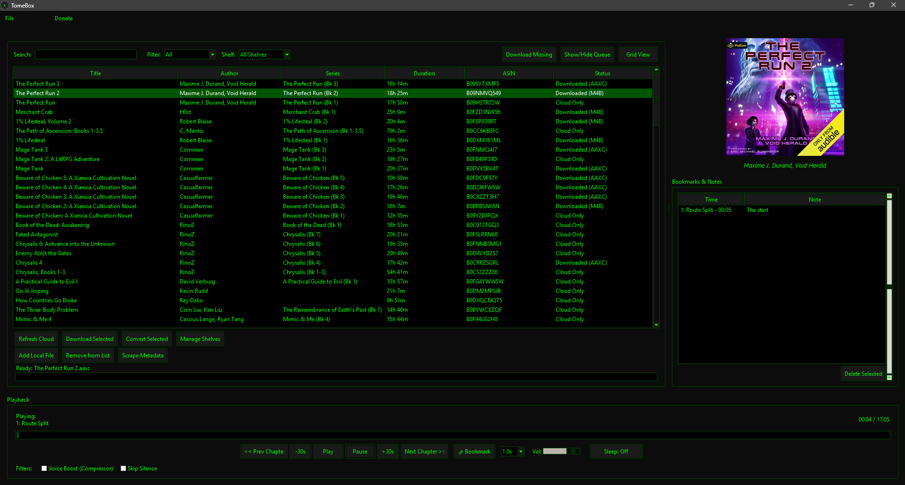
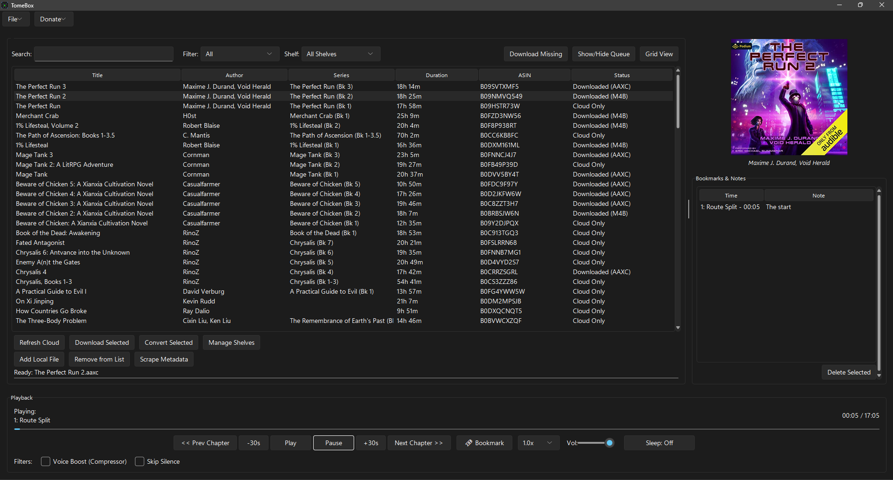

# TomeBox

TomeBox is a desktop application for managing, downloading, playing, and converting Audible audiobooks. It provides a unified interface for your cloud library and local files, built-in DRM decryption, and chapter-aware playback.

## Get Started (Zero-Config Installation)

TomeBox is designed to be completely portable and requires zero technical configuration. The automated setup scripts handle Python installation, dependency management, and FFmpeg binary acquisition seamlessly.

1. **Download and Extract** the TomeBox repository folder.
2. **Windows:** Double-click `setup.bat`. 
   * *If Python is missing, it will silently download and install it. It will also fetch portable FFmpeg binaries and drop a shortcut on your desktop.*
3. **Mac/Linux:** Open your terminal, navigate to the folder, and run `bash setup.command`.
4. **Launch:** Use the newly created desktop shortcut to open the application!

*(Note: TomeBox includes a built-in auto-updater. Launching the app via the shortcut will silently check GitHub for updates and pull the latest code before booting).*

## Screenshots

### Unified List View

*Managing cloud and local files in the classic list view.*

### Dynamic Grid View

*Browsing the library with fetched high-res cover art.*

### Colour Pallets

*Oooooooo*

*Ahhhhhhh!*
### Modern Engine Support

*Woooooow*

## Features

### Advanced Playback Engine
* **Persistent State Memory:** Auto-saves the exact timestamp and current chapter index on exit, pause, or skip.
* **Audio Filters:** Toggle real-time dynamic range compression (Voice Boost) and silence-skipping via native FFplay injection.
* **Smart Sleep Timer:** Set countdowns by exact minutes or trigger an auto-pause at the end of the current chapter.
* **Manual Bookmarking:** Drop timestamped pins with custom text notes while listening. Double-click a bookmark in the side-panel to instantly jump back to that moment.
* **Dynamic Speed Control:** Adjust playback from 0.8x to 3.0x on the fly without modifying the source file.

### Library & Organization
* **Unified Data View:** Merges Audible API cloud data with local file system paths into a single grid or list view.
* **Custom Shelves:** Create custom, comma-separated tags to organize your library, filterable via the main navigation bar.
* **Direct Metadata Scraper:** Easily fix orphaned local files. TomeBox queries the Audible catalog to pull missing high-res cover art, series data, and authors, embedding them directly into your local `.m4b` or `.mp3` files via ID3 tags.
* **Silent Background Polling:** A daemon thread queries the Audible API every 15 minutes to detect new purchases, updating the cache without interrupting the UI.

### Multi-User Authentication & Decryption
* **Dynamic Key Swapping:** Share a single `library.json` and download folder with multiple profiles. If User B plays a legacy `.aax` file downloaded by User A, TomeBox automatically loads User A's decryption bytes in the background.
* **Native DRM Handling:** Automatically requests the `Adrm` content license via the API to extract offline AAXC encryption keys (`audible_key` and `audible_iv`).
* **Multi-Region Support:** Built-in locale switching (US, UK, AU, CA, DE, FR, JP) for accurate catalog querying.

### Downloading & Conversion
* **Piped Conversion:** Bypasses temporary file creation by piping decrypted streams directly into standard `.m4b` container formats.
* **Chapter Extraction:** Parses metadata to allow splitting a single audiobook into multiple, sequentially numbered files based on chapter timestamps.
* **Throttled UI Streaming:** Downloads utilize 32KB chunk streams with throttled UI progress updates, preventing interface lockups on gigabit connections.

### Progression System
* **LitRPG Achievement Tracker:** A persistent background tracker logs your total seconds listened, books downloaded, and books finished.
* **Milestone Toasts:** Unlocking an achievement triggers a borderless, non-intrusive notification in the corner of your screen.
* **Status Dashboard:** View your locked and unlocked milestones, complete with progress bars, in the dedicated "My Achievements" window.

### User Interface & Export
* **Dual Engine Architecture:** Switch between the modern Windows 11 style (`sv_ttk`) and the classic engine (featuring 8 hardcoded developer themes like Solarized, Dracula, Cyberpunk, and Nordic Slate).
* **Data Export:** Dump your library to a flattened CSV file or generate an offline, CSS-styled HTML gallery of your collection.
* **System Tray Intergration:** Minimizes to system tray for neat and clean runtime. 

## Application Data

TomeBox respects your system and does not bury files in hidden AppData folders. It generates the following local files directly in its root directory:
* `library.json`: Tracks local file paths, metadata, custom shelves, and playback history.
* `cloud_cache.json`: Caches your Audible library metadata to reduce API calls.
* `auth_[ProfileName].json`: Stores your active Audible session data.
* `settings.json`: Stores application preferences, UI themes, and your achievement/stats database.
* `aax_manager.log`: Output log for debugging and process tracking.
* `.tomebox_version`: Local hash file used by the auto-updater.
