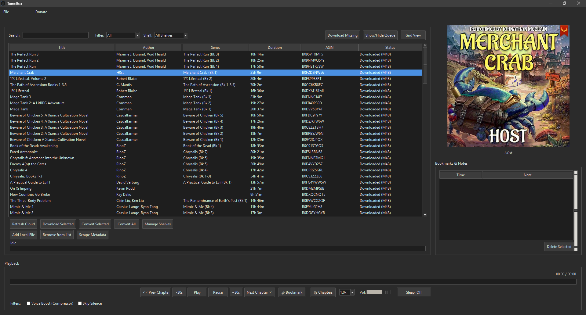
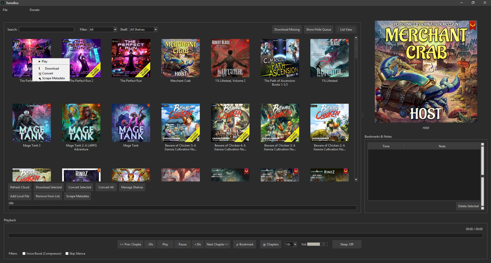
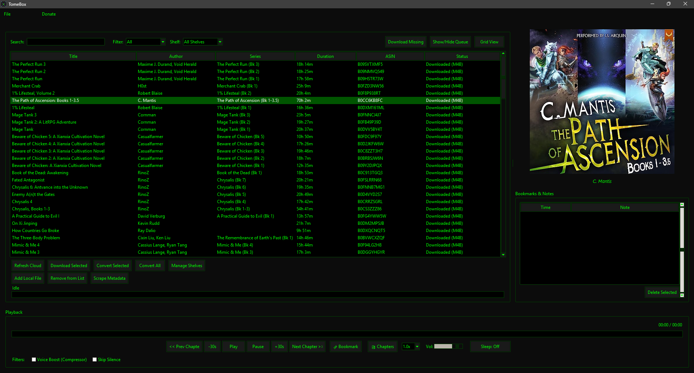
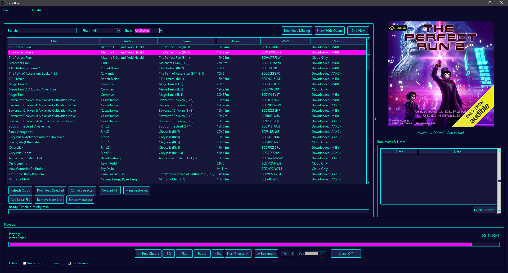
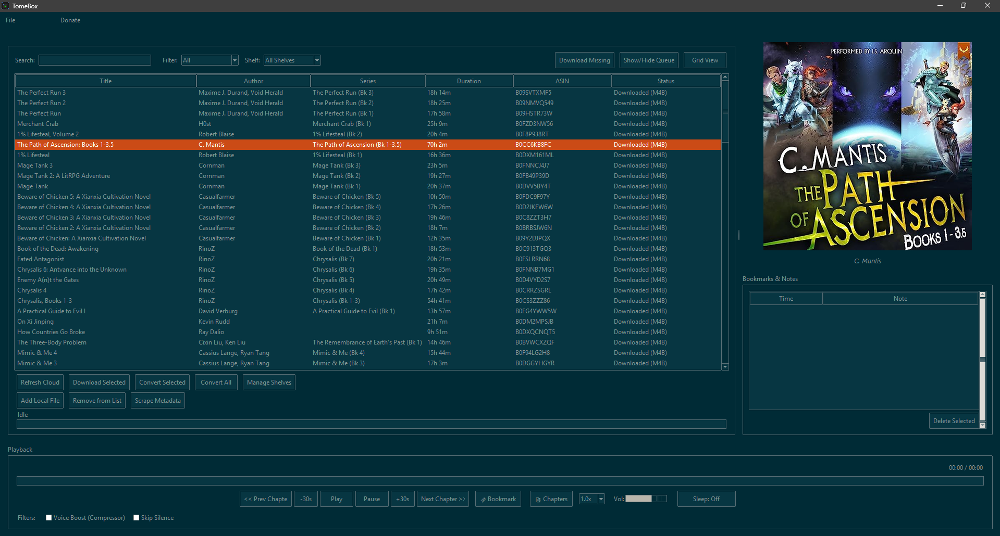

# TomeBox

**TomeBox** is a local-first audiobook manager and self-hosted media server. It combines a powerful desktop application for downloading, converting, and playing your Audible library with a built-in companion web app for streaming to your mobile devices. Featuring on-the-fly DRM decryption, multi-user cross-device progress syncing, and native lock-screen controls, TomeBox gives you complete ownership of your audiobooks without relying on cloud subscriptions.

## Get Started (Zero-Config Installation)

TomeBox is designed to be completely portable and requires zero technical configuration. The automated setup scripts handle Python installation, dependency management, and FFmpeg binary acquisition seamlessly.

1. **Download and Extract** the TomeBox repository folder.
2. **Windows:** Double-click `setup.bat`. 
   * *If Python is missing, it will silently download and install it. It will also fetch portable FFmpeg binaries and drop a shortcut on your desktop.*
3. **Mac/Linux:** Open your terminal, navigate to the folder, and run `bash setup.command`.
4. **Launch:** Use the newly created desktop shortcut to open the application.
5. **Login** Go to File -> Authentication & Profiles, follow the prompts to log in and begin downlaoding.
   
*(Note: TomeBox includes a built-in auto-updater. Launching the app via the shortcut will silently check GitHub for updates and pull the latest code before booting).*

## Screenshots

### Unified List View

*Managing cloud and local files in the classic list view. Now with Context Menues!*

### Dynamic Grid View

*Browsing the library with fetched high-res cover art.*

### Colour Pallets

*Oooooooo!*
*Ahhhhhhh!*

### Web Player

*Daaaaaammmmnnn*
## Features

### Advanced Playback Engine
* **Persistent State Memory:** Auto-saves the exact timestamp and current chapter index on exit, pause, or skip.
* **Audio Filters:** Toggle real-time dynamic range compression (Voice Boost) and silence-skipping via native FFplay injection.
* **Smart Sleep Timer:** Set countdowns by exact minutes or trigger an auto-pause at the end of the current chapter.
* **Manual Bookmarking:** Drop timestamped pins with custom text notes while listening. Double-click a bookmark in the side-panel to instantly jump back to that moment.
* **Dynamic Speed Control:** Adjust playback from 0.8x to 3.0x on the fly without modifying the source file.

### Library & Organization
* **Unified Data View:** Merges Audible API cloud data with local file system paths into a single grid or list view.
* **Custom Shelves:** Create custom, comma-separated tags to organize your library, filterable via the main navigation bar.
* **Direct Metadata Scraper:** Easily fix orphaned local files. TomeBox queries the Audible catalog to pull missing high-res cover art, series data, and authors, embedding them directly into your local `.m4b` or `.mp3` files via ID3 tags.
* **Silent Background Polling:** A daemon thread queries the Audible API every 15 minutes to detect new purchases, updating the cache without interrupting the UI.
* **Interactive Chapter Navigation:** A table of contents window that displays parsed chapter metadata and timestamps, allowing users to jump directly to specific sections via double-click.
* **Context Menus:** Native right-click menus integrated into both the list and grid views, providing immediate access to playback controls, timeline seeking, bookmarking, and file operations.
* **Drag-and-Drop Import:** Direct OS-level drag-and-drop support for adding files to the library, utilizing a background worker to extract metadata via ffprobe without freezing the interface.
* **Live Cover Previews:** Single-click integration on library items that dynamically fetches and displays high-resolution cover art in the side panel without triggering audio playback.

### Multi-User Authentication & Decryption
* **Dynamic Key Swapping:** Share a single `library.json` and download folder with multiple profiles. If User B plays a legacy `.aax` file downloaded by User A, TomeBox automatically loads User A's decryption bytes in the background.
* **Native DRM Handling:** Automatically requests the `Adrm` content license via the API to extract offline AAXC encryption keys (`audible_key` and `audible_iv`).
* **Multi-Region Support:** Built-in locale switching (US, UK, AU, CA, DE, FR, JP) for accurate catalog querying.

### Downloading & Conversion
* **Piped Conversion:** Bypasses temporary file creation by piping decrypted streams directly into standard `.m4b` container formats.
* **Chapter Extraction:** Parses metadata to allow splitting a single audiobook into multiple, sequentially numbered files based on chapter timestamps.
* **Throttled UI Streaming:** Downloads utilize 32KB chunk streams with throttled UI progress updates, preventing interface lockups on gigabit connections.
* **Batch Conversion:** A dedicated process that scans the local library for encrypted files and sequentially converts them into standard m4b format in a background thread.

### Progression System
* **LitRPG Achievement Tracker:** A persistent background tracker logs your total seconds listened, books downloaded, and books finished.
* **Milestone Toasts:** Unlocking an achievement triggers a borderless, non-intrusive notification in the corner of your screen.
* **Status Dashboard:** View your locked and unlocked milestones, complete with progress bars, in the dedicated "My Achievements" window.

### User Interface & Export
* **Dual Engine Architecture:** Switch between the modern Windows 11 style (`sv_ttk`) and the classic engine (featuring 8 hardcoded developer themes like Solarized, Dracula, Cyberpunk, and Nordic Slate).
* **Data Export:** Dump your library to a flattened CSV file or generate an offline, CSS-styled HTML gallery of your collection.
* **System Tray Intergration:** Minimizes to system tray for neat and clean runtime. 

### Local Companion Web Server
* **Embedded Daemon:** FastAPI server runs in a background thread inside the Tkinter process, avoiding GUI blocking.

* **Menu Integration:** Toggleable via the desktop File menu; automatically retrieves and displays the host machine's local IP address.

* **Chunked Audio Streaming:** Implements HTTP 206 Partial Content endpoints to stream .m4b files in 64KB chunks, allowing timeline scrubbing without loading full files into memory.

* **Metadata Hydration:** API dynamically merges library.json data with the cloud_cache and local .jpg directory to serve complete book profiles (authors, shelves, covers) to the frontend.

### Web Player Interface
* **Mobile-First SPA:** Responsive single-page application built in vanilla HTML/CSS/JS without build steps or heavy frameworks.

* **Live Filtering:*** Client-side grid filtering by search query (title/author) and custom desktop shelves.

* **MediaSession Hook:** Pushes cover art, title, and author data to OS-level media controllers (lock screens, smartwatches, Bluetooth car displays).

### Playback & Controls
* **Dynamic Chapter Parsing:** Executes ffprobe on demand to extract MP4 chapter markers, generating an interactive chapter selection menu.

* **Hardware Skip Integration:** Maps physical OS media buttons (previous/next track) to audiobook chapter skips and 15-second jumps.

* **Playback Speed:** Cycles through 1.0x to 2.0x speeds, maintaining state across track changes.

* **Advanced Sleep Timer:** Configurable by raw minutes (15/30/60) or custom chapter counts. Chapter-based sleep calculates the exact future timestamp and pauses precisely on the chapter boundary.

### Progress Sync & Multi-User Tracking
* **Profile Integration:** Fetches desktop user profiles and isolates playback progress within the database, preventing multiple users from overriding each other.

* **Heartbeat Sync:** Browser posts the current timestamp to the backend every 10 seconds during active playback.

* **Bi-Directional Format Translation:** Desktop GUI translates absolute time (from the web) into chapter-relative time (for ffplay), allowing seamless resuming between PC and mobile devices.

## Application Data

TomeBox respects your system and does not bury files in hidden AppData folders. It generates the following local files directly in its root directory:
* `library.json`: Tracks local file paths, metadata, custom shelves, and playback history.
* `cloud_cache.json`: Caches your Audible library metadata to reduce API calls.
* `auth_[ProfileName].json`: Stores your active Audible session data.
* `settings.json`: Stores application preferences, UI themes, and your achievement/stats database.
* `aax_manager.log`: Output log for debugging and process tracking.
* `.tomebox_version`: Local hash file used by the auto-updater.

# Roadmap

## Ui changes

### UI Engine Replacement: 
Migrating the frontend away from Tkinter.

## Phase 2: The Ecosystem Shift

### Multi-Provider Support: 
Abstract the Audible API logic to support adding modules for Soundbooth Theater or other DRM-free stores.

## Acknowledgments

TomeBox stands on the shoulders of giants. This project is only possible thanks to the incredible work of the open-source community. A massive thank you to the maintainers and contributors of the following projects:

* **[FFmpeg & FFplay](https://ffmpeg.org/):** The absolute powerhouse driving the DRM decryption, audio conversion, chapter extraction, and playback engine.
* **[audible (Python Library)](https://github.com/mkb79/audible):** The brilliant unofficial Audible API wrapper by mkb79 that makes cloud synchronization, authentication, and metadata scraping possible.
* **[sv-ttk (Sun Valley TTK)](https://github.com/rdbende/Sun-Valley-ttk-theme):** For bringing a beautiful, modern, Windows-native dark theme to classic Tkinter.
* **[Pillow (PIL)](https://python-pillow.org/):** Handling the high-res cover art processing, resizing, and rendering for the visual grid.
* **[Pycaw](https://github.com/AndreMiras/pycaw):** Enabling the native OS-level volume mixer hooks on Windows.
* **[Gyan.dev](https://www.gyan.dev/ffmpeg/builds/):** For providing the highly available, pre-compiled portable FFmpeg Windows binaries used in the automated installer.
