# TomeBox 

**TomeBox** is a local-first audiobook manager and self-hosted media server. A desktop application organises, transcodes, and plays your library; a native Android client and a built-in web player stream it to your devices — on your home network, or anywhere else through a WireGuard tunnel the app raises on demand. Multi-profile progress syncing, chapter-aware playback across single-file and multi-part books, offline downloads, and native lock-screen controls, with no cloud subscription and no third-party service in the path.

## Why it's built the way it is

* **Seamless network failover.** Playback continues uninterrupted when you walk out the front door. A custom ExoPlayer `DataSource` swaps between LAN and tunnel addresses beneath the player, so the switch happens inside the existing buffer — no error, no rebuffer, no audible gap.
* **Tunnel on demand, not always-on.** LAN is probed first, every time. The tunnel only comes up when you're genuinely away, and drops itself when you're home or idle — no VPN slot held, no battery cost, no fighting your other VPNs.
* **One chapter implementation, four surfaces.** Chapter navigation is remapped once at the player layer, so the in-app controls, the notification, Bluetooth and the home screen widget all inherit it — including multi-part books where chapters are separate files.
* **Offline-first by construction.** The library, cover art, chapter maps and playback positions are all on disk. The phone is authoritative for anything it recorded; the server fills in what it hasn't seen.
* **Runs headless.** systemd unit, Windows service, or a single `--headless` flag. Pair a new device by scanning a QR code printed to the terminal.

## Community

For users of **TomeBox** looking to report bugs, ask questions, submit feedback and request features, visit us at [r/TomeBox](https://www.reddit.com/r/TomeBox/).

## Get Started

TomeBox offers two installation paths depending on your needs.

### Option 1: Pre-built Release (Recommended for Most Users)

The fastest way to get started — no Python, no terminals, no setup.

1. **Download** the latest `TomeBox-Windows.zip` from the [Releases page](https://github.com/Gravtas-J/tomebox/releases).
2. **Extract** the entire folder anywhere you like (Documents, Desktop, Program Files — your choice).
3. **Run** `TomeBox.exe` to launch the application.
4. *(Optional)* Run `create_shortcut.bat` to add a desktop shortcut for quick access.
5. **Login:** Click `File → Authentication & Profiles`, choose your region, and follow the prompts to link your Audible account.

> **Windows SmartScreen Notice:** The first time you run TomeBox, Windows may flag it as "unrecognised". This is normal for indie software without a paid code-signing certificate. Click **More info → Run anyway** to proceed. The application is open source — you can verify the code yourself in this repository.

### Option 2: From Source (For Developers / Linux / Mac)

If you want to run TomeBox from source, contribute to development, or you're on a non-Windows platform:

1. **Download and Extract** the TomeBox repository folder.
2. **Windows:** Double-click `setup.bat`. 
   * *If Python is missing, it will silently download and install it. It will also fetch portable FFmpeg binaries and drop a shortcut on your desktop.*
3. **Mac/Linux:** Open your terminal, navigate to the folder, and run `bash setup.command`.
4. **Launch:** Use the newly created desktop shortcut to open the application.
5. **Login:** Go to `File → Authentication & Profiles`, follow the prompts to log in and begin downloading.

## System Requirements

* **Windows 10 or 11 (64-bit)** for the pre-built release
* **Windows / macOS / Linux** for source installs (Python 3.11+ recommended)
* **~500MB disk space** (includes bundled FFmpeg)
* **Internet connection** for Audible features (offline playback works without)

## Headless / Server Deployment

TomeBox can run without a desktop UI, perfect for NAS, home servers, or 
always-on machines. Three deployment paths supported:

### Quick Headless (any platform)

    python main.py --headless

Or with the pre-built EXE:

    TomeBox.exe --headless

A QR code prints to the terminal — scan it with your phone to pair instantly. Go to <your-ip>:8000/pair to pair new devices from already authed devices.

### Windows Service

1. Install [NSSM](https://nssm.cc/download) and add it to your PATH
2. Right-click `service/install_windows_service.bat` → Run as administrator
3. Manage via Windows Services panel or `nssm start TomeBox`

### Linux systemd

    sudo bash service/install_linux_service.sh
    sudo systemctl start tomebox

The service runs as a dedicated `tomebox` user with hardened permissions.

### Docker

    docker compose up -d

Mount `./audiobooks` to your library directory in `docker-compose.yml`.

By default the headless server binds to all interfaces on port 8000. 
Override with `--host 127.0.0.1 --port 9000` for local-only or custom ports.

## Screenshots

### Unified List View
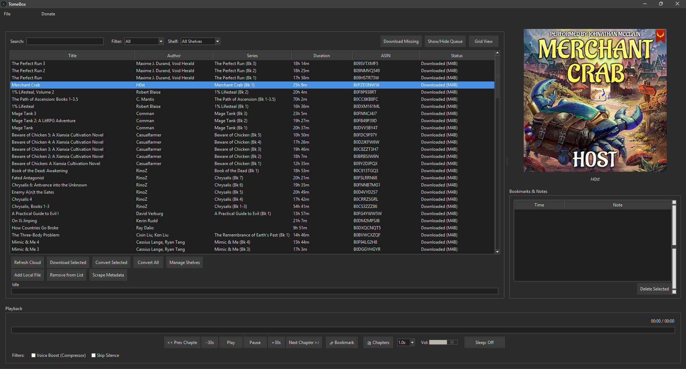
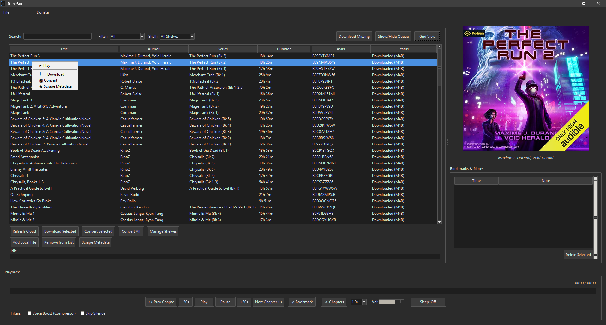
*Managing cloud and local files in the classic list view. Now with Context Menus!*

### Dynamic Grid View
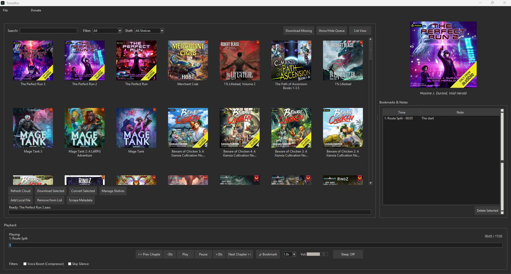
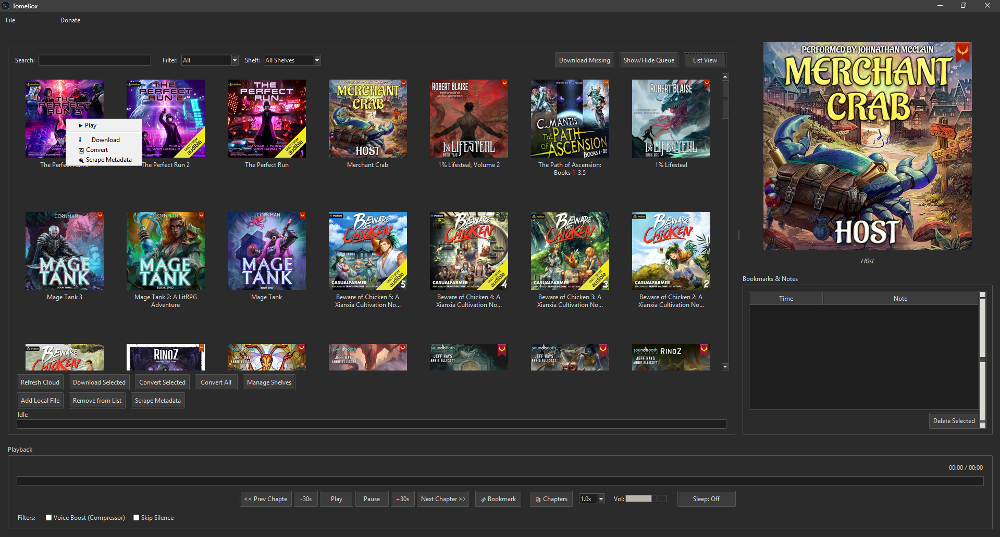
*Browsing the library with fetched high-res cover art.*

### Colour Palettes
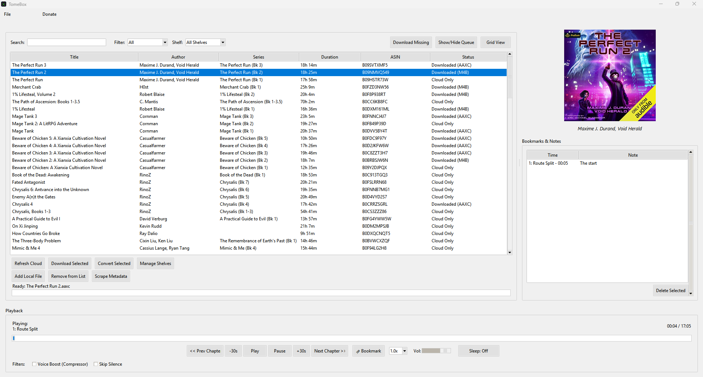
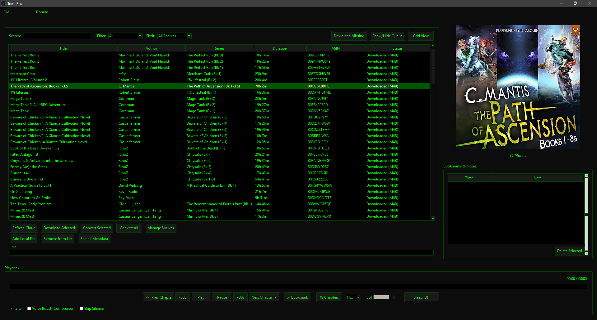
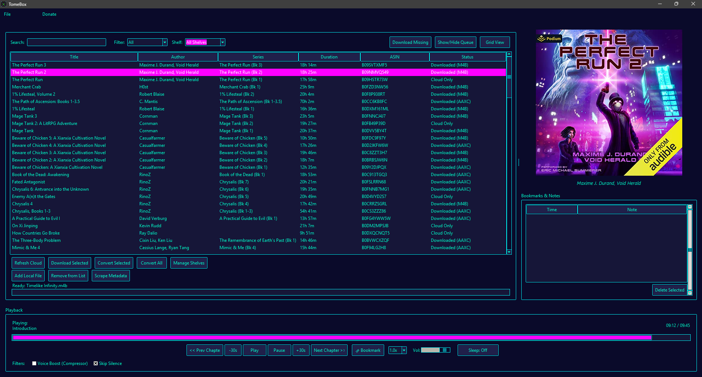
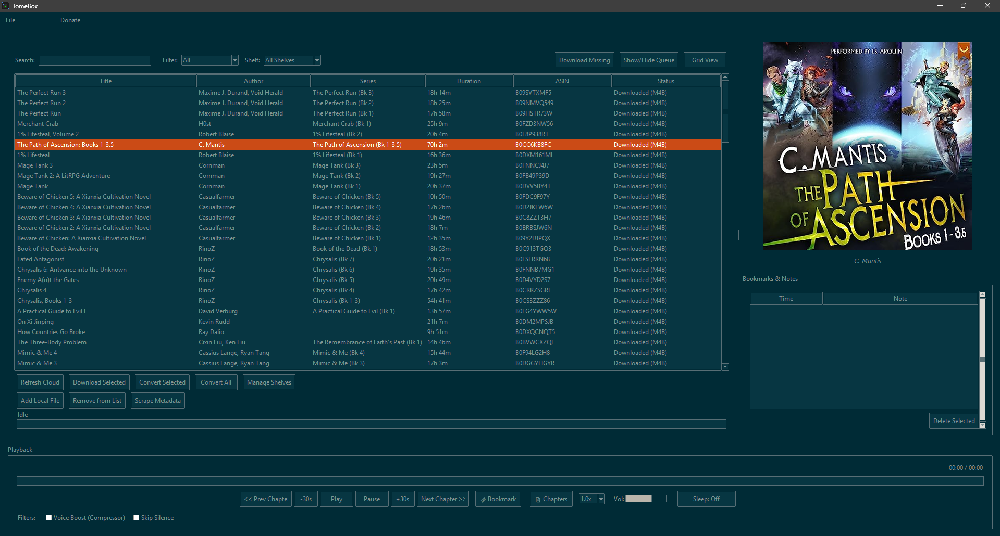
*Oooooooo!*
*Ahhhhhhh!*

### Web Player
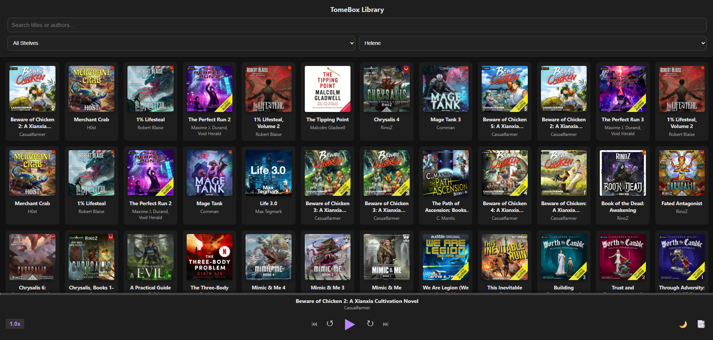
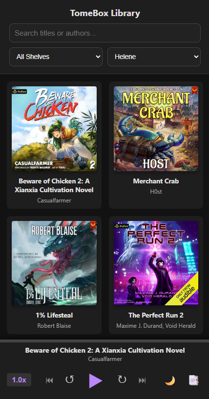
*Daaaaaammmmnnn*

## Andoid Application
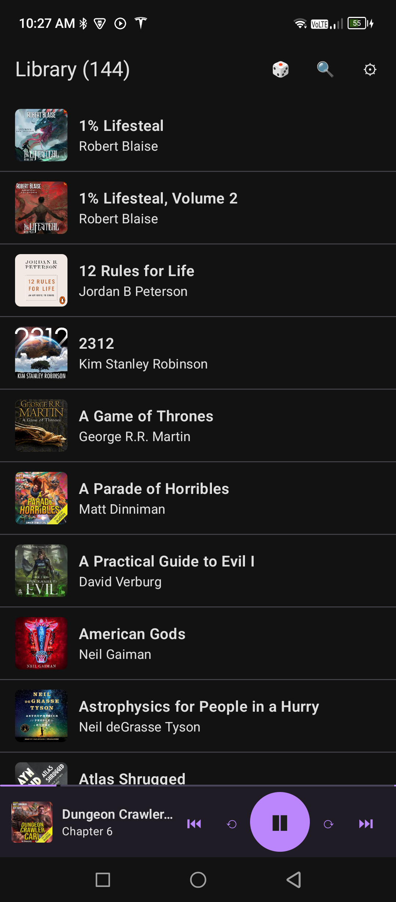
*Shocked Noises*
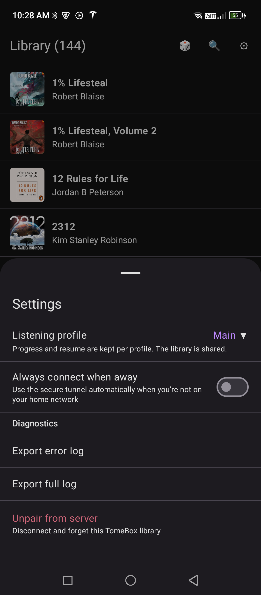
*Appreciative Nods*
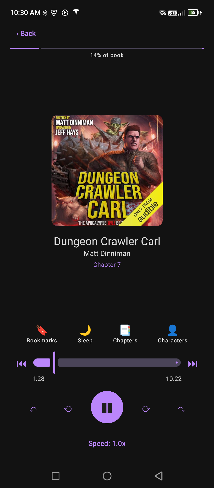
*Niiiiceee!*

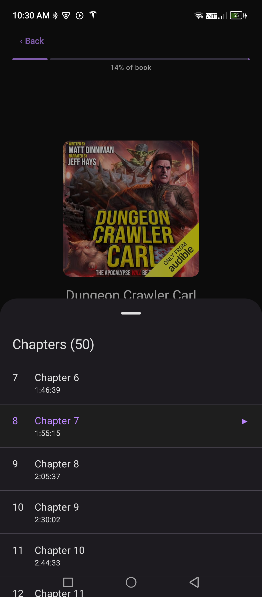
*Eeeeeee!*
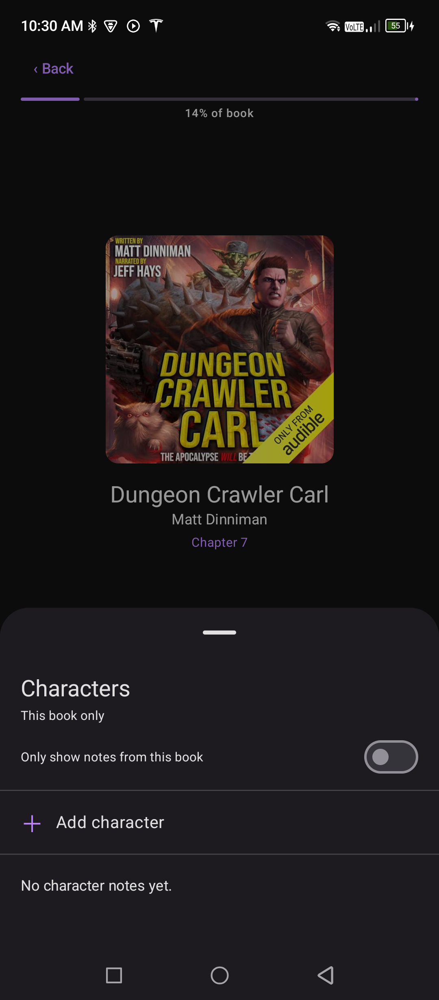
*Hmmmmmm!*
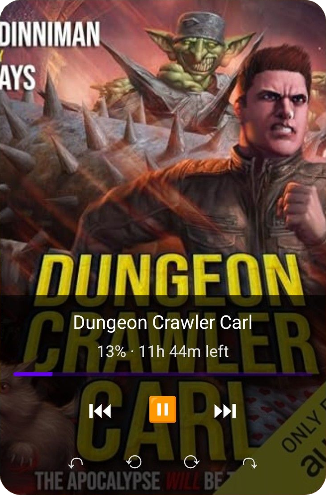
*Wooooooaaaahhhhh*

## Features

### Advanced Playback Engine
* **Persistent State Memory:** Auto-saves the exact timestamp and current chapter index on exit, pause, or skip.
* **Audio Filters:** Toggle real-time dynamic range compression (Voice Boost) and silence-skipping via native FFplay injection.
* **Smart Sleep Timer:** Set countdowns by exact minutes or trigger an auto-pause at the end of the current chapter.
* **Manual Bookmarking:** Drop timestamped pins with custom text notes while listening. Double-click a bookmark in the side-panel to instantly jump back to that moment.
* **Dynamic Speed Control:** Adjust playback from 0.8x to 3.0x on the fly without modifying the source file.

### Library & Organization
* **Unified Data View:** Merges Audible API cloud data with local file system paths into a single grid or list view.
* **Custom Shelves:** Create custom, comma-separated tags to organize your library, filterable via the main navigation bar.
* **Direct Metadata Scraper:** Easily fix orphaned local files. TomeBox queries the Audible catalog to pull missing high-res cover art, series data, and authors, embedding them directly into your local `.m4b` or `.mp3` files via ID3 tags.
* **Silent Background Polling:** A daemon thread queries the Audible API every 15 minutes to detect new purchases, updating the cache without interrupting the UI.
* **Interactive Chapter Navigation:** A table of contents window that displays parsed chapter metadata and timestamps, allowing users to jump directly to specific sections via double-click.
* **Context Menus:** Native right-click menus integrated into both the list and grid views, providing immediate access to playback controls, timeline seeking, bookmarking, and file operations.
* **Live Cover Previews:** Single-click integration on library items that dynamically fetches and displays high-resolution cover art in the side panel without triggering audio playback.

### Importing Existing Audiobooks

TomeBox can import audiobooks you've already downloaded or liberated:

- **Drag and drop** files directly into the library view
- **Add Local File** for individual books
- **Import Folder** to recursively scan a directory 

When importing, TomeBox automatically matches your files against your Audible cloud library by title to avoid duplicates. If a book isn't matched (e.g. it's no longer in your Audible library, or has a significantly different filename), it'll appear as a local-only entry. You can manually link it to a cloud item using **Scrape Metadata**.

### Multi-User Authentication & Library Sharing
* **Cross-Profile Playback:** Share a single library across multiple profiles. If User B plays a file originally imported by User A, TomeBox resolves the right credentials automatically in the background.
* **Automatic Format Handling:** Retrieves the content license for files you own and prepares them for local playback, so imports work without manual configuration.
* **Multi-Region Support:** Built-in locale switching (US, UK, AU, CA, DE, FR, JP) for accurate catalog querying.

### Downloading & Conversion
* **Piped Conversion:** Bypasses temporary file creation by piping converted streams directly into standard `.m4b` container formats.
* **Chapter Extraction:** Parses metadata to allow splitting a single audiobook into multiple, sequentially numbered files based on chapter timestamps.
* **Throttled UI Streaming:** Downloads utilize 32KB chunk streams with throttled UI progress updates, preventing interface lockups on gigabit connections.
* **Batch Conversion:** A dedicated process that scans the local library for encrypted files and sequentially converts them into standard m4b format in a background thread.

### Progression System
* **LitRPG Achievement Tracker:** A persistent background tracker logs your total seconds listened, books downloaded, and books finished.
* **Milestone Toasts:** Unlocking an achievement triggers a borderless, non-intrusive notification in the corner of your screen.
* **Status Dashboard:** View your locked and unlocked milestones, complete with progress bars, in the dedicated "My Achievements" window.

### User Interface & Export
* **Dual Engine Architecture:** Switch between the modern Windows 11 style (`sv_ttk`) and the classic engine (featuring 8 hardcoded developer themes like Solarized, Dracula, Cyberpunk, and Nordic Slate).
* **Data Export:** Dump your library to a flattened CSV file or generate an offline, CSS-styled HTML gallery of your collection.
* **System Tray Integration:** Minimizes to system tray for neat and clean runtime. 

### Local Companion Web Server
* **Embedded Daemon:** FastAPI server runs in a background thread inside the desktop process, avoiding GUI blocking.
* **Menu Integration:** Toggleable via the desktop File menu; automatically retrieves and displays the host machine's local IP address.
* **QR Code Pairing:** Scan a QR code from the desktop to securely pair your phone with the server in one tap. Go to <your-ip>:8000/pair to pair new devices from already authed devices.
* **Chunked Audio Streaming:** Implements HTTP 206 Partial Content endpoints to stream `.m4b` files in 64KB chunks, allowing timeline scrubbing without loading full files into memory.
* **Metadata Hydration:** API dynamically merges library data with the cloud cache and local cover directory to serve complete book profiles (authors, shelves, covers) to the frontend.

### Web Player Interface
* **Mobile-First SPA:** Responsive single-page application built in vanilla HTML/CSS/JS without build steps or heavy frameworks.
* **PWA Installable:** Add the web player to your phone's home screen for a native app feel — full-screen, no browser chrome, persistent across sessions.
* **Live Filtering:** Client-side grid filtering by search query (title/author) and custom desktop shelves.
* **MediaSession Hook:** Pushes cover art, title, and author data to OS-level media controllers (lock screens, smartwatches, Bluetooth car displays).

### Playback & Controls
* **Dynamic Chapter Parsing:** Executes ffprobe on demand to extract MP4 chapter markers, generating an interactive chapter selection menu.
* **Hardware Skip Integration:** Maps physical OS media buttons (previous/next track) to audiobook chapter skips and 15-second jumps.
* **Playback Speed:** Cycles through 1.0x to 2.0x speeds, maintaining state across track changes.
* **Advanced Sleep Timer:** Configurable by raw minutes (15/30/60) or custom chapter counts. Chapter-based sleep calculates the exact future timestamp and pauses precisely on the chapter boundary.

### Progress Sync & Multi-User Tracking
* **Profile Integration:** Fetches desktop user profiles and isolates playback progress within the database, preventing multiple users from overriding each other.
* **Heartbeat Sync:** Browser posts the current timestamp to the backend every 10 seconds during active playback.
* **Bi-Directional Format Translation:** Desktop translates absolute time (from the web) into chapter-relative time (for ffplay), allowing seamless resuming between PC and mobile devices.

## Application Data

TomeBox respects your system and does not bury files in hidden AppData folders. It generates the following local files directly in its root directory:

* `data/tomebox.db`: SQLite database tracking local file paths, metadata, custom shelves, settings, and playback history.
* `data/cloud_[ProfileName].json`: Caches your Audible library metadata to reduce API calls.
* `data/auth_[ProfileName].json`: Stores your active Audible session data.
* `covers/`: Directory of cached high-resolution cover art (one `.jpg` per ASIN).
* `logs/tomebox.log`: Rotating output log for debugging and process tracking.

## Troubleshooting

**TomeBox won't launch / crashes immediately:** Check `logs/tomebox.log` for the error trace. The most common cause is missing FFmpeg binaries in the install folder.

**Downloads fail with "Not authenticated":** Re-link your Audible account via `File → Authentication & Profiles`. Tokens occasionally expire and need refreshing.

**Web companion can't connect:** Make sure your phone and PC are on the same Wi-Fi network. The companion only works on local networks unless you set up your own VPN.

**Windows SmartScreen blocks the EXE:** Click "More info" then "Run anyway". This happens with all unsigned indie software.

**Found a bug?** Please report it on [GitHub Issues](https://github.com/Gravtas-J/tomebox/issues) or in [r/TomeBox](https://www.reddit.com/r/TomeBox/).

## Android Client

A native Kotlin app that pairs with your TomeBox server and streams your library — at home over the LAN, or anywhere else through a WireGuard tunnel it brings up on its own.

### Pairing

1. On the desktop, enable the companion server: `File → Enable Web Server`
2. Open the Android app and scan the QR code.
3. Follow the `Set up remote access` prompts if you want WAN capabilities.

That's it. The QR carries the LAN address, a one-time code, and — if remote access is configured — the tunnel credentials. The app exchanges the one-time code for a durable token, so nothing reusable is left sitting in a scanned image.

To pair a second device without going back to the desktop, `File → Show Pairing Info` or visit `<your-ip>:8000/pair` from a device that's already paired.

### Playback

* **Chapter navigation everywhere.** Previous and next mean *chapter*, not track — in the app, in the notification, on Bluetooth controls, and on a headset. Works identically whether the book is a single M4B with embedded chapters or a folder of per-chapter files played as one continuous timeline.
* **Variable speed** from 0.5x to 3.0x, with finer steps below 1.0 where small changes matter more.
* **Sleep timer** by minutes, or set it to stop at the end of the current chapter.
* **Bookmarks and character notes.** Timestamped bookmarks with notes; character notes scoped to a series, tagged with the book you wrote them in so later volumes don't spoil earlier ones.
* **Autoplay the series.** Finish a book and the next one starts, if you want it to.

### Offline

* **Download for offline listening** from the library, the mini player, or the full player.
* Downloads run in a foreground worker, so they survive backgrounding and process death, and resume from where they stopped rather than restarting a 400MB transfer.
* Chapter maps and cover art are cached alongside the audio — a downloaded book behaves identically with no server in sight.

### Home screen widget

Cover art fills the widget with a frosted panel behind the controls. Play/pause, chapter skip, and ±15s / ±1m seeking, plus whole-book progress and time remaining. It reads from disk rather than from the running app, so it keeps showing the right thing after Android has reaped the process.

### Remote access

The app probes your LAN first, every time. If it answers, you're home and no tunnel is raised. If it doesn't, the WireGuard tunnel comes up, playback continues, and the tunnel drops again when you're back on the home network or after a period of inactivity.

This ordering is deliberate: many consumer routers won't hairpin traffic sent to your own public IP from inside the network, so at home the direct route is both faster and more reliable.

Mid-playback network changes are handled beneath the player — the address swaps inside the existing buffer, so walking out of wifi range doesn't produce an error or an playback gap.

### Profiles

Multiple listeners share one library with independent progress and resume points. Switch profiles from the app's settings; profiles can also be created from the phone. The library itself stays shared — only progress is namespaced.

### Diagnostics

The app keeps a rolling on-device log, exportable as a full log or errors-only, so a bug report doesn't require a computer and a USB cable.

### Installation

Currently distributed via the release page, with running updates distributed to testers directly via the [Discord](https://discord.gg/UPtFFZN5W). Play Store availability is pending.

### Requirements

* Android 8.0 (API 26) or later
* A running TomeBox server on your network
* Remote access additionally requires the one-time WireGuard setup on the desktop (prompted when you first enable the web server), which needs administrator permission once

## Roadmap

### Phase 1: UI Modernisation
* **Web-Based UI:** Replace the Tkinter desktop interface with a unified web frontend, accessible both natively (via embedded webview) and through any browser.

### Phase 2: Ecosystem Expansion
* **Multi-Provider Support:** Abstract the Audible-specific logic to support DRM-free providers like Libro.fm and Downpour.
* **Unified Library:** One interface for every audiobook you own, regardless of where you bought it.

## Acknowledgments

TomeBox stands on the shoulders of giants. This project is only possible thanks to the incredible work of the open-source community. A massive thank you to the maintainers and contributors of the following projects:

* **[FFmpeg & FFplay](https://ffmpeg.org/):** The absolute powerhouse driving the DRM decryption, audio conversion, chapter extraction, and playback engine.
* **[audible (Python Library)](https://github.com/mkb79/audible):** The brilliant unofficial Audible API wrapper by mkb79 that makes cloud synchronization, authentication, and metadata scraping possible.
* **[sv-ttk (Sun Valley TTK)](https://github.com/rdbende/Sun-Valley-ttk-theme):** For bringing a beautiful, modern, Windows-native dark theme to classic Tkinter.
* **[Pillow (PIL)](https://python-pillow.github.io/):** Handling the high-res cover art processing, resizing, and rendering for the visual grid.
* **[Pycaw](https://github.com/AndreMiras/pycaw):** Enabling the native OS-level volume mixer hooks on Windows.
* **[FastAPI](https://fastapi.tiangolo.com/):** Powering the embedded companion web server with modern async HTTP handling and automatic API documentation.
* **[Gyan.dev](https://www.gyan.dev/ffmpeg/builds/):** For providing the highly available, pre-compiled portable FFmpeg Windows binaries.

## License

MIT License

Copyright (c) 2026 Jesse Dale

Permission is hereby granted, free of charge, to any person obtaining a copy
of this software and associated documentation files (the "Software"), to deal
in the Software without restriction, including without limitation the rights
to use, copy, modify, merge, publish, distribute, sublicense, and/or sell
copies of the Software, and to permit persons to whom the Software is
furnished to do so, subject to the following conditions:

The above copyright notice and this permission notice shall be included in all
copies or substantial portions of the Software.

THE SOFTWARE IS PROVIDED "AS IS", WITHOUT WARRANTY OF ANY KIND, EXPRESS OR
IMPLIED, INCLUDING BUT NOT LIMITED TO THE WARRANTIES OF MERCHANTABILITY,
FITNESS FOR A PARTICULAR PURPOSE AND NONINFRINGEMENT. IN NO EVENT SHALL THE
AUTHORS OR COPYRIGHT HOLDERS BE LIABLE FOR ANY CLAIM, DAMAGES OR OTHER
LIABILITY, WHETHER IN AN ACTION OF CONTRACT, TORT OR OTHERWISE, ARISING FROM,
OUT OF OR IN CONNECTION WITH THE SOFTWARE OR THE USE OR OTHER DEALINGS IN THE
SOFTWARE.

TomeBox's own source code is released under the MIT License (see LICENSE).
Prebuilt releases bundle third-party components — notably Mutagen, licensed under the GNU GPL v2.0 or later. Because these are distributed as part of the packaged builds, the combined binary releases of TomeBox are provided under the terms of the GPL v2.0 or later. The complete corresponding source is available in this repository.
See THIRD_PARTY_LICENSES.md for all bundled dependencies and their licenses.